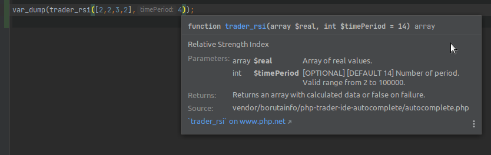

# PHP Trader - IDE autocomplete

This package allows you to activate the auto-complete in the IDE for native functions from the extension: [PHP Trader](https://www.php.net/manual/en/ref.trader.php).

## Installation

Install the library using Composer. Please read the [Composer Documentation](https://getcomposer.org/doc/01-basic-usage.md) if you are unfamiliar with Composer or dependency managers in general.

You don't need this package in production, please use `require-dev`.
```shell
composer require --dev borutainfo/php-trader-ide-autocomplete
```

That's it, the IDE autocomplete should work.

## Requirements

Package exists in two versions:
- version 1.* for PHP 5.5 and above: requires PHP >= 5.5 and `ext-trader` >= 0.4.1
- version 2.* for PHP 7.0 and above: requires PHP >= 7.0 and `ext-trader` >= 0.4.1

## About

If your IDE does not auto-complete functions from the PHP Trader extension, add this package to your project to fix it. The file `autocomplete.php` contains documentation of the functions from the extension mentioned above, without their implementation. This file is not automatically loaded by composer and you shouldn't include it. It's just its presence in the project directory, which fixes the missing documentation in the IDE. Just add the package to composer and your IDE should start displaying the documentation correctly.



The package has been created based on [LupeCode/phpTraderInterface](https://github.com/LupeCode/phpTraderInterface).

